# 🏠 Estate-Miner: Egyptian Real Estate Market Data Mining & Analytics

<p align="center">


</p>

<p align="center">

**An end-to-end Data Analytics pipeline for the Egyptian Real Estate Market.**

</p>

---

# 📌 Project Overview

**Estate-Miner** is a comprehensive data engineering and analytics project designed to automate the collection, processing, and analysis of Egyptian real estate listings.

The project begins by scraping live property listings using **Playwright**, followed by an extensive data cleaning and preprocessing pipeline to transform raw, inconsistent data into a structured dataset suitable for analysis.

After cleaning, several meaningful features are engineered to better describe each property, enabling comprehensive exploratory data analysis (EDA) and preparing the dataset for future machine learning applications.

The project follows the complete data lifecycle:

- 🌐 Web Scraping
- 🧹 Data Cleaning
- ⚙️ Data Preprocessing
- 🧠 Feature Engineering
- 📊 Exploratory Data Analysis
- 🤖 Machine Learning Ready Dataset

---

# 🎯 Project Objectives

The primary objectives of this project are:

- Build an automated web scraper for Egyptian real estate listings.
- Collect high-quality structured property data.
- Clean inconsistent and noisy data.
- Engineer meaningful analytical features.
- Discover hidden market patterns using Exploratory Data Analysis.
- Identify the main factors affecting property prices.
- Prepare a clean dataset for future predictive models.

---

# 📈 Dataset Summary

| Metric | Value |
|---------|------:|
| Total Listings | **919** |
| Total Features | **45** |
| Missing Values | **0** |
| Duplicate Records | **0** |
| Numerical Features | **34** |
| Categorical Features | **10** |
| Boolean Features | **1** |

The dataset includes detailed information about Egyptian real estate listings, including:

- Property Price
- Property Area
- Bedrooms
- Bathrooms
- Property Type
- Region
- Sub Area
- Amenities
- Furnishing Status
- Maid Room Availability
- Availability Date

---

# 🚀 Project Pipeline

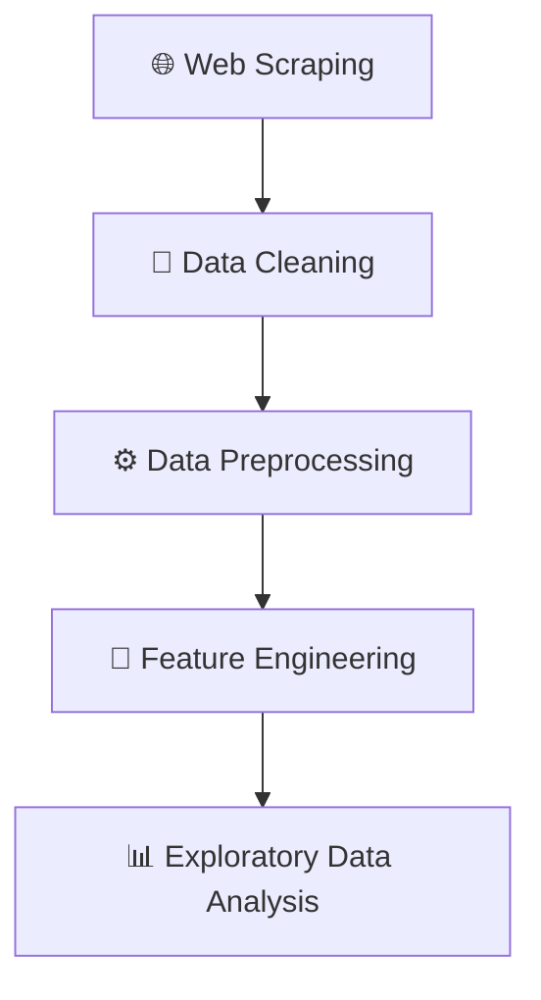

---

# ⚙️ Technologies Used

## Programming Language

- Python

---

## Web Scraping

- Playwright
- Requests
- python-dotenv

---

## Data Processing

- Pandas
- NumPy
- Scikit-Learn

---

## Data Visualization

- Matplotlib
- Seaborn

---

# 📂 Project Structure

```text
Estate-Miner/
│
├── Data/
│   ├── Scrapped_Data.csv
│   ├── cleaned_data.csv
│   └── preprocessed_data.csv
│
├── Web Scrapping/
│   ├── config.py
│   ├── exploresite.py
│   └── localScrapper.py
│
├── Cleaning.ipynb
├── Preprocessing.ipynb
├── Real_Estate_EDA.ipynb
│
├── EDA_Outputs/
│   ├── amenity_area_and_price_diff.png
│   ├── amenity_frequency_and_price.png
│   ├── categorical_distributions.png
│   ├── categorical_price_distributions.png
│   ├── categorical_vs_categorical.png
│   ├── correlation_matrix.png
│   ├── numerical_distributions.png
│   ├── numerical_boxplots.png
│   ├── price_distribution_analysis.png
│   ├── property_area_distribution.png
│   ├── regional_price_and_volume.png
│   ├── relationship_analysis.png
│   ├── region_property_type_pricing.png
│   ├── subarea_price_and_volume.png
│   └── ...
│
├── requirements.txt
├── README.md
└── LICENSE
```

---

# 🕸️ Web Scraping

The project starts by automatically collecting Egyptian real estate listings using **Playwright**.

### Collected Attributes

- Property Title
- Price
- Bedrooms
- Bathrooms
- Maid Room
- Area
- Property Type
- Available Date
- Region
- Sub Area
- Amenities

### Scraper Features

- Automated browser interaction
- Dynamic page handling
- Retry mechanism
- Concurrent scraping
- Progress recovery after interruption
- Batch CSV exporting
- Telegram notifications
- Automatic dataset generation

---

# 🧹 Data Cleaning

The raw scraped data contained several inconsistencies that required preprocessing before analysis.

### Cleaning Steps

- Removed duplicate records.
- Standardized column names.
- Converted prices into numerical values.
- Parsed area measurements.
- Standardized date formats.
- Cleaned location information.
- Separated Region and Sub Area.
- Extracted amenities.
- Created binary amenity indicators.
- Corrected malformed area values.
- Removed invalid records.
- Ensured logical consistency across numerical features.

---

# ⚙️ Data Preprocessing & Feature Engineering

Several new features were created to enhance analytical capabilities.

| Feature | Description |
|----------|-------------|
| **price_per_sqm** | Property price divided by area. |
| **amenities_count** | Total number of available amenities. |
| **total_rooms** | Bedrooms + Bathrooms. |
| **price_per_bedroom** | Price allocated per bedroom. |
| **price_per_bathroom** | Price allocated per bathroom. |
| **area_per_bedroom** | Average area available per bedroom. |
| **area_per_bathroom** | Average area available per bathroom. |
| **amenities_per_room** | Amenities density per room. |

These engineered features provide additional business insights and improve the dataset's readiness for future predictive modeling.

---

# 📊 Exploratory Data Analysis (EDA)

The Exploratory Data Analysis was divided into multiple sections to understand the dataset from different perspectives:

1. Dataset Overview
2. Data Quality Assessment
3. Univariate Analysis
4. Target Variable Analysis
5. Location Analysis
6. Property Characteristics Analysis
7. Amenities Analysis
8. Relationship Analysis
9. Feature Engineering Evaluation
10. Correlation Analysis & Feature Selection
11. Executive Summary

---

# 📈 Key Findings

The following sections present the most important visualizations and business insights extracted from the dataset.

---
# 📊 Exploratory Data Analysis

The Exploratory Data Analysis (EDA) was conducted to understand the characteristics of the Egyptian real estate market and identify the key factors influencing property prices.

The analysis covered numerical features, categorical features, geographical distribution, engineered features, and feature relationships.

---

# 🎯 Target Variable Analysis

## Property Price Distribution

<p align="center">

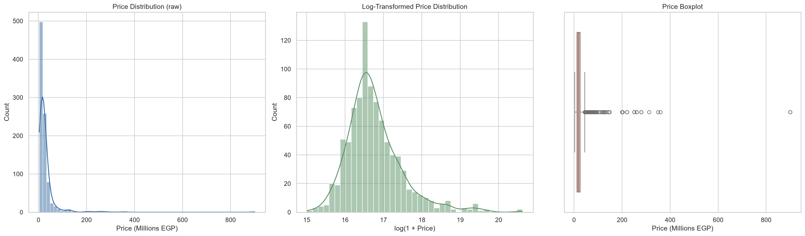

</p>

### Insights

- Property prices range from **3.3M EGP** to **90M EGP**, indicating a wide variety of market segments.
- The distribution is **highly right-skewed**, with a relatively small number of luxury properties creating extreme values.
- Applying a **logarithmic transformation** significantly improves the distribution, making it more suitable for future machine learning models.

---

# 📐 Property Area Distribution

<p align="center">

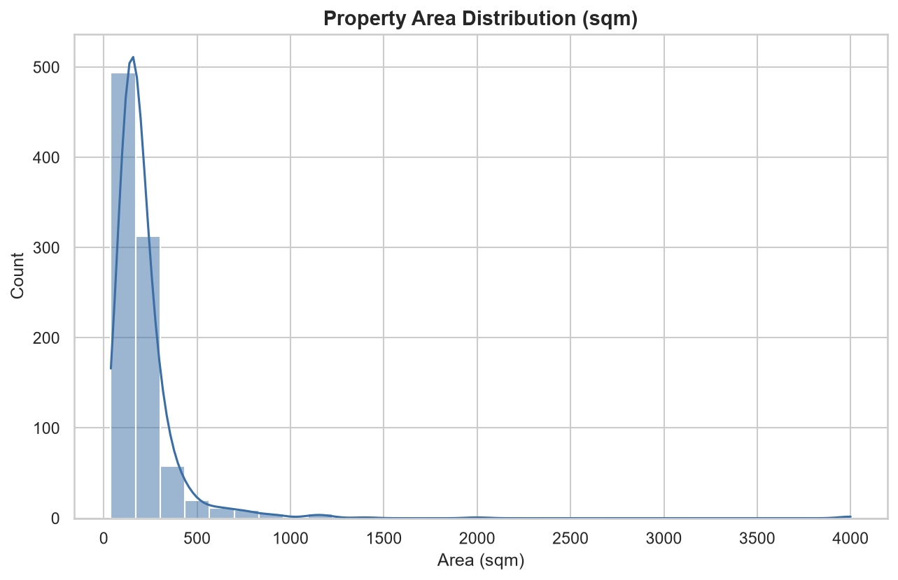

</p>

### Insights

- Most residential properties range between **100 and 300 sqm**.
- Large luxury villas create several extreme outliers.
- The distribution is positively skewed, reflecting the dominance of medium-sized properties.

---

# 📈 Numerical Feature Distributions

<p align="center">

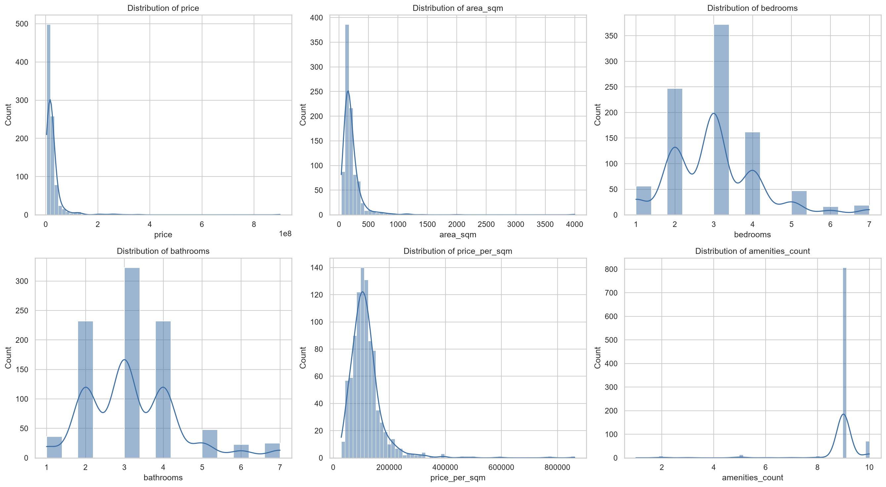

</p>

### Insights

- Bedrooms are concentrated around **3 bedrooms**, which represents the typical residential property.
- Bathrooms generally range between **2 and 4**.
- Price per square meter varies considerably across the market.
- Amenities Count is concentrated around a small number of amenities.
- Engineered features show reasonable distributions suitable for analytical purposes.

---

# 📦 Outlier Analysis

<p align="center">

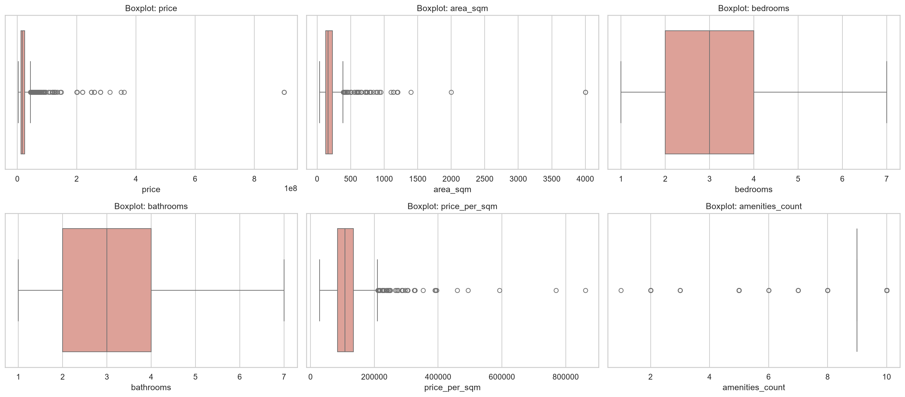

</p>

### Insights

- Price contains several luxury outliers.
- Area also contains a few exceptionally large properties.
- Outliers were intentionally retained because they represent real luxury listings rather than erroneous data.

---

# 🏡 Property Characteristics

<p align="center">

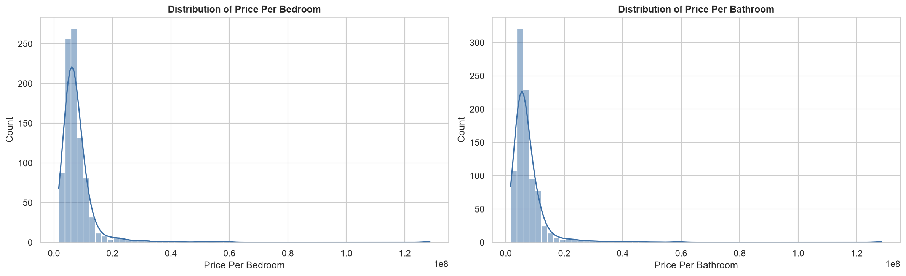

</p>

### Insights

- Most properties contain **3 bedrooms**.
- Properties with **2–3 bathrooms** dominate the dataset.
- Luxury properties with 6+ bedrooms are relatively uncommon.

---

<p align="center">

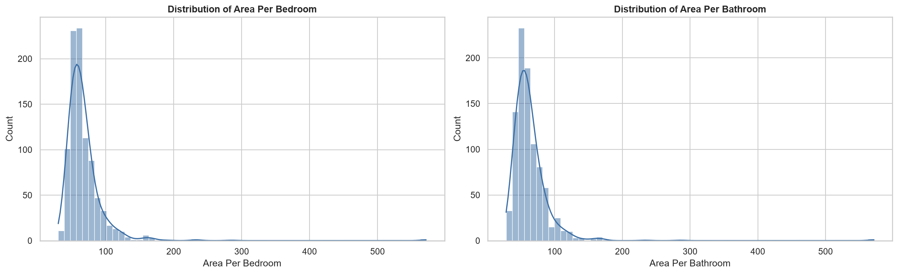

</p>

### Insights

- Area per bedroom generally falls within a consistent range.
- Extremely spacious properties appear only in the luxury market.

---

<p align="center">

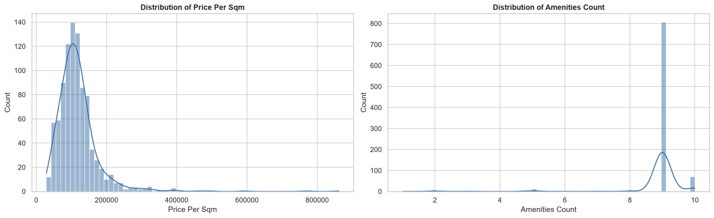

</p>

### Insights

- Price per square meter varies substantially across different regions.
- Most listings include a moderate number of amenities.

---

<p align="center">

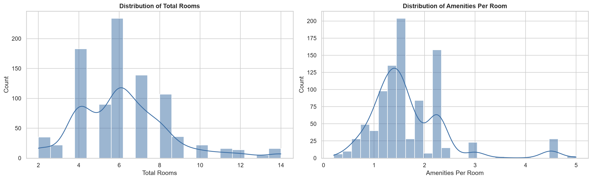

</p>

### Insights

- Larger properties generally contain more rooms.
- Amenities per room remain relatively stable across most properties.

---

# 🏢 Categorical Feature Analysis

<p align="center">

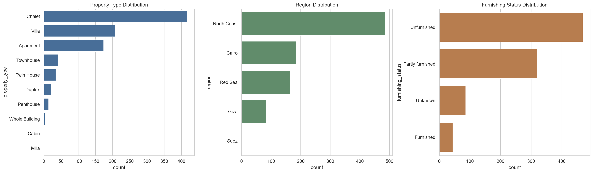

</p>

### Insights

- **Chalets** represent the largest property category.
- **North Coast** dominates the dataset, accounting for more than half of all listings.
- Most properties are **Unfurnished**.
- Only a minority of properties include a Maid Room.

---

# 💰 Price Distribution Across Categories

<p align="center">

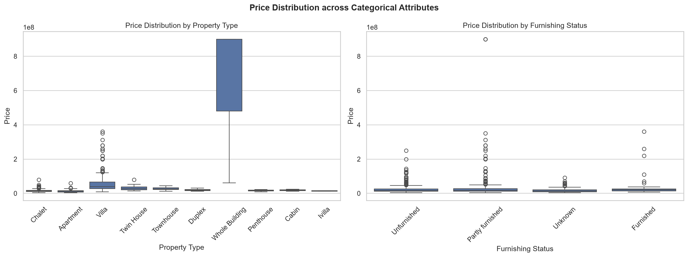

</p>

### Insights

- Villas generally achieve the highest prices.
- Cairo properties have the highest median prices.
- Furnished properties tend to have higher prices.
- Maid Room availability is associated with higher-value properties.

---

# 📍 Regional Analysis

<p align="center">

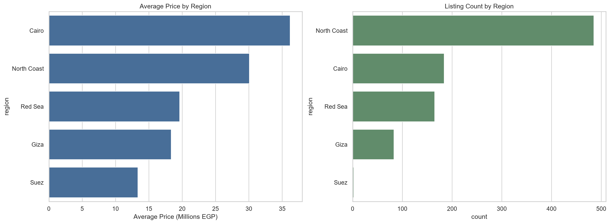

</p>

### Insights

### Average Property Price

- Cairo records the highest average property price.
- North Coast follows due to luxury resorts and vacation properties.
- Giza offers comparatively lower average prices.

### Listing Volume

- North Coast contributes more than **50%** of all listings.
- Cairo and Red Sea follow as the second and third largest markets.

---

# 🗺️ Sub-Area Analysis

<p align="center">

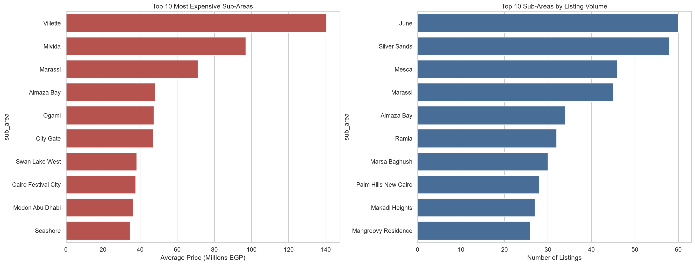

</p>

### Insights

### Most Expensive Areas

- Villette
- Mivida
- Marassi
- Almaza Bay
- Ogami

These areas consistently represent Egypt's premium real estate market.

### Highest Listing Volume

- June
- Silver Sands
- Marassi
- Palm Hills New Cairo
- Almaza Bay

These locations account for the highest market activity.

---

# 🏠 Property Type by Region

<p align="center">

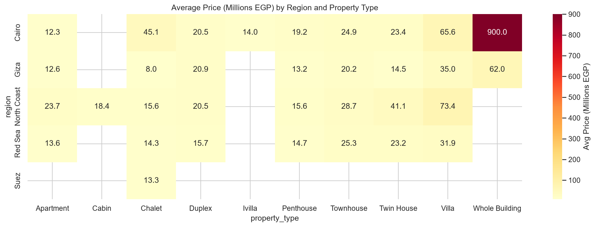

</p>

### Insights

- Villas dominate luxury pricing across multiple regions.
- Whole Buildings represent the highest-value properties.
- Chalets command premium prices in North Coast.
- Apartments remain the most affordable property type.

---

# 🛠 Amenities Analysis

<p align="center">

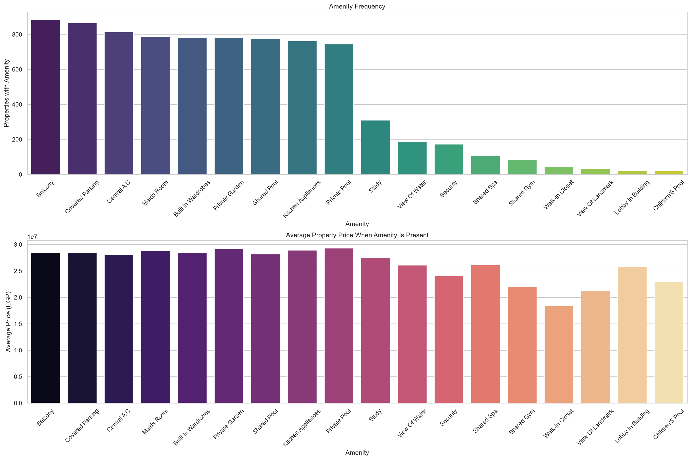

</p>

### Insights

- Balcony and Covered Parking are the most common amenities.
- Private Pools and Private Gardens are primarily associated with luxury properties.
- Standard amenities contribute little to price variation.

---

<p align="center">

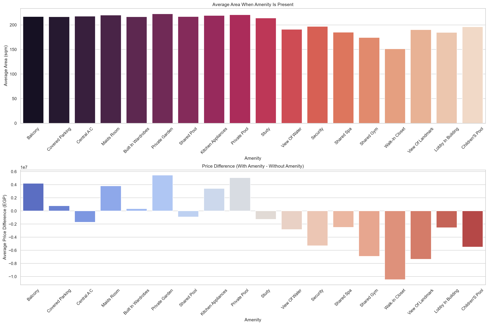

</p>

### Insights

- Properties with premium amenities generally have:
  - Larger areas.
  - Higher average prices.
- Luxury amenities significantly differentiate premium listings.

---

# 🔗 Relationship Analysis

<p align="center">

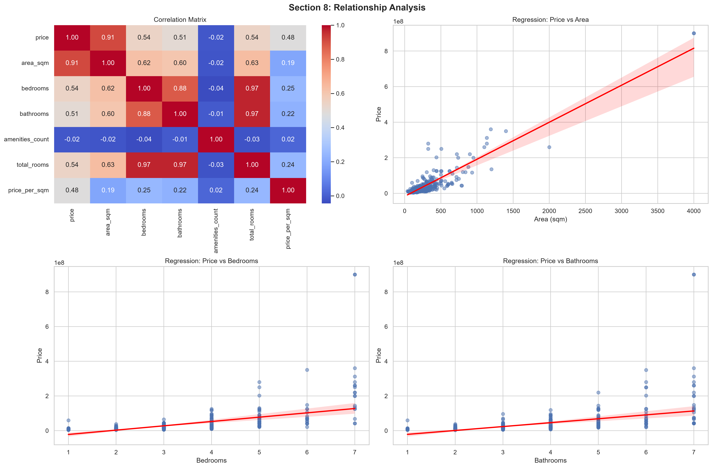

</p>

### Key Findings

- Area exhibits the strongest positive relationship with price.
- Bedrooms and Bathrooms show moderate positive relationships.
- Amenities Count demonstrates a weak relationship with pricing.

---

<p align="center">

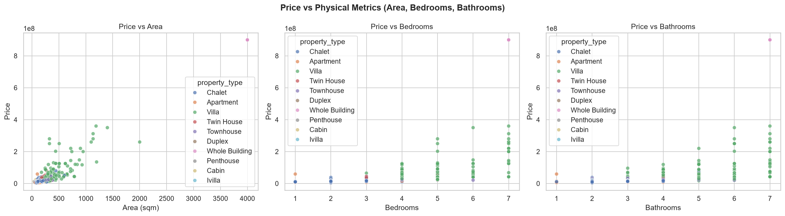

</p>

### Insights

- Property Area is the strongest pricing factor.
- Bedrooms and Bathrooms moderately influence property value.
- Larger homes consistently command higher prices.

---

<p align="center">

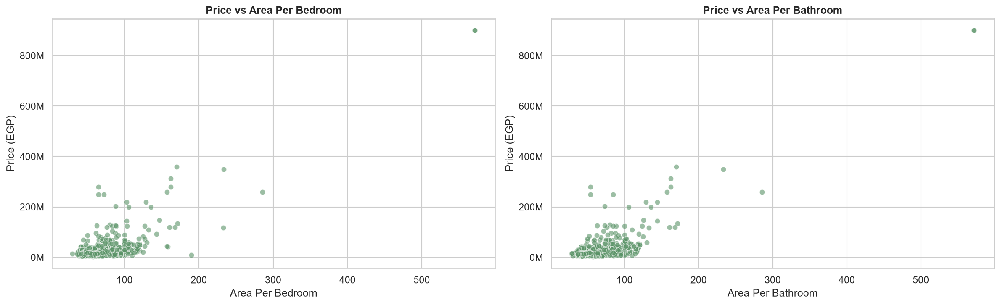

</p>

### Insights

The scatter plots confirm that:

- Price generally increases as Area increases.
- Bedrooms and Bathrooms have positive but weaker relationships with price.
- Luxury properties create several noticeable outliers.

---

<p align="center">

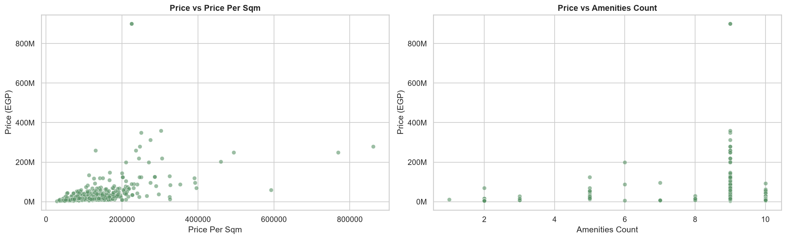

</p>

### Insights

- Price per Square Meter varies considerably across regions.
- Amenities Count alone is not a strong predictor of price.

---

<p align="center">

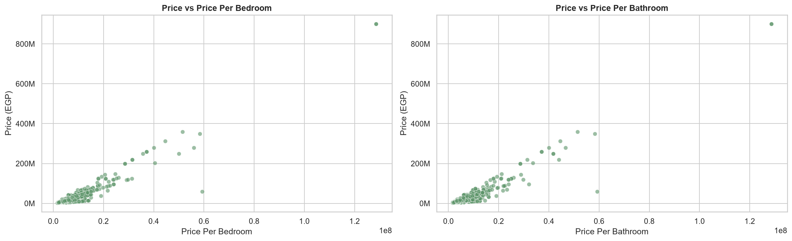

</p>

### Insights

Luxury homes exhibit substantially higher:

- Price per Bedroom.
- Price per Bathroom.

These engineered features capture pricing density effectively but should not be used directly in machine learning because they are derived from the target variable.

---

<p align="center">

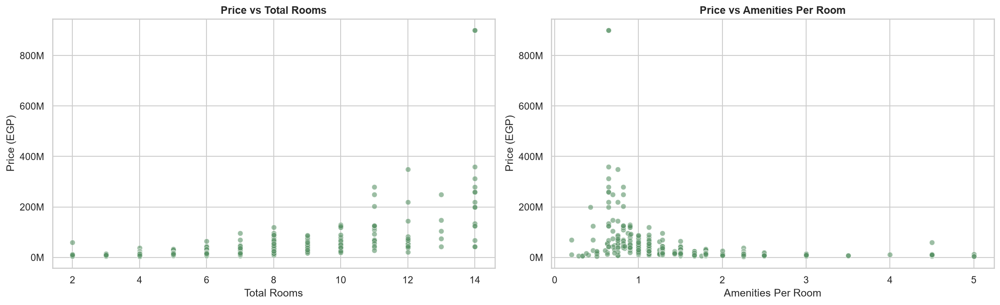

</p>

### Insights

- Total Rooms positively correlate with property prices.
- Amenities per Room has only a weak relationship with property value.

---

# 🔥 Correlation Analysis

<p align="center">

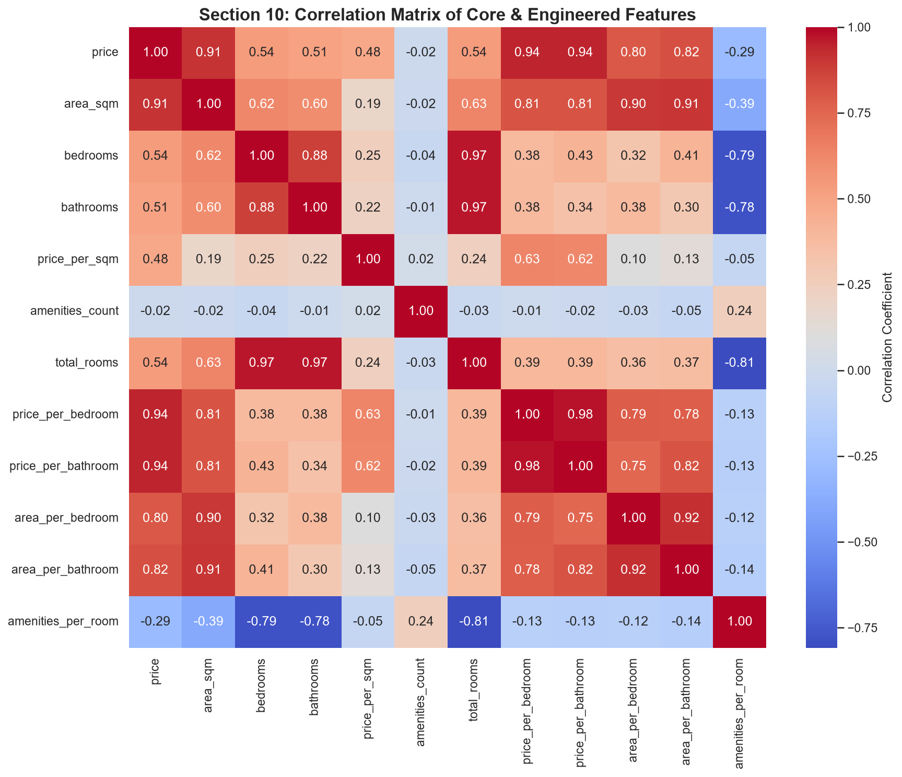

</p>

### Major Findings

- **Area** has the strongest positive correlation with Price.
- Bedrooms and Bathrooms show moderate positive relationships.
- Engineered features containing Price introduce target leakage.
- Several size-related variables exhibit multicollinearity and should be handled carefully before machine learning.
---

# 💡 Executive Summary

This project successfully demonstrates a complete end-to-end data engineering and data analytics workflow for the Egyptian real estate market.

Starting from automated web scraping, the project transforms raw online property listings into a structured, high-quality dataset through comprehensive cleaning and preprocessing before performing detailed exploratory data analysis.

The generated insights reveal the primary drivers of property prices, regional market dynamics, and the impact of property characteristics and amenities.

The final dataset is well-prepared for future predictive machine learning applications.

---

# 📊 Key Business Insights

After analyzing hundreds of Egyptian real estate listings, several important observations were identified.

## 📈 Pricing

- Property prices are highly right-skewed due to luxury listings.
- Property Area is the strongest factor affecting price.
- Price per Square Meter provides a more meaningful comparison than total property price.
- Luxury properties create several significant outliers but represent valid market observations.

---

## 🏡 Property Characteristics

- Most residential properties contain **3 bedrooms**.
- Most properties have **2–3 bathrooms**.
- The majority of listings fall between **100 and 300 square meters**.
- Villas and Whole Buildings represent the premium market segment.

---

## 📍 Geographic Trends

- North Coast contains the largest number of listings.
- Cairo records the highest average property prices.
- Luxury developments are concentrated in a limited number of premium locations.

---

## 🛠 Amenities

- Basic amenities such as balconies and covered parking are common across most listings.
- Premium amenities (Private Pool, Private Garden, Shared Spa) are primarily associated with luxury properties.
- The number of amenities alone is not a strong indicator of property price.

---

## 📊 Feature Engineering

The engineered features provided valuable analytical insights.

The most informative engineered features include:

- Price per Square Meter
- Amenities Count
- Total Rooms
- Area per Bedroom
- Area per Bathroom

However, features directly derived from the target variable should not be used during model training.

Examples include:

- Price per Bedroom
- Price per Bathroom

These introduce **Target Leakage** and would artificially inflate model performance.

---

# 🤖 Machine Learning Readiness

The preprocessing pipeline prepares the dataset for future predictive modeling.

Completed preprocessing tasks include:

- Data Cleaning
- Feature Engineering
- Date Processing
- Area Standardization
- Numerical Feature Extraction
- Binary Feature Creation
- Outlier Analysis

Recommended next steps include:

- One-Hot Encoding
- Feature Scaling
- Train/Test Split
- Model Training
- Hyperparameter Optimization

Potential regression algorithms include:

- Linear Regression
- Random Forest Regressor
- XGBoost Regressor
- LightGBM
- CatBoost

---

# 🚀 Future Work

Future improvements may include:

- Property Price Prediction using Machine Learning
- Interactive Power BI Dashboard
- Streamlit Web Application
- Real-Time Daily Web Scraping
- Automated Data Pipeline
- Property Recommendation System
- Interactive Geographic Maps
- Time-Series Market Analysis

---

# 📦 Installation

Clone the repository:

```bash
git clone https://github.com/AmirAliAttiaAli/Estate-Miner.git

cd Estate-Miner
```

Install dependencies:

```bash
pip install -r requirements.txt
```

---

# ▶️ Running the Scraper

```bash
python localScrapper.py
```

The scraper automatically:

- Visits listing pages
- Extracts property information
- Handles retries
- Supports resume after interruption
- Exports CSV batches
- Merges all batches into a final dataset

---

# 📊 Running the Analysis

Launch Jupyter Notebook:

```bash
jupyter notebook
```

Run the notebooks in the following order:

1. Cleaning.ipynb

2. Preprocessing.ipynb

3. Real_Estate_EDA.ipynb

---

# 📚 Requirements

```
playwright
requests
python-dotenv
numpy
pandas
scikit-learn
matplotlib
seaborn
```

---

# 👥 Contributors

This project was developed collaboratively by:

| Name | GitHub |
|------|--------|
| **Amir Ali** | [@AmirAliAttiaAli](https://github.com/AmirAliAttiaAli) |
| **Omar Ahmed** | [@OmarCoder9](https://github.com/OmarCoder9) |
| **Mohamed Radwan** | [@Mohamed-Ramadan-Radwan](https://github.com/Mohamed-Ramadan-Radwan) |

---

# 🌟 Support

If you found this project useful, consider giving it a ⭐ on GitHub.

Your support helps improve the project and motivates future development.

---

# 📄 License

This project is licensed under the **MIT License**.

---

<p align="center">

⭐ If you like this project, don't forget to leave a star!

</p>
