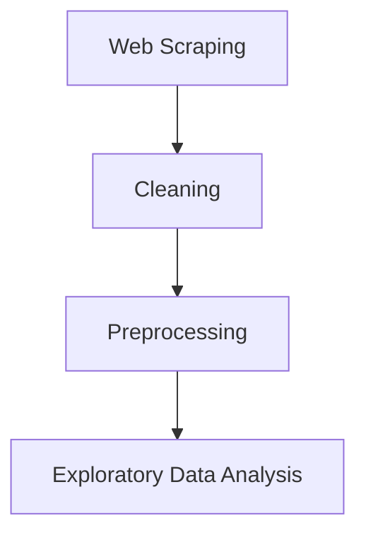

# 🏠 Estate-Miner: Egyptian Real Estate Market Data Mining & EDA


Estate-Miner is an end-to-end data mining project designed to collect, clean, preprocess, and analyze Egyptian real estate listings. The project covers the complete data lifecycle, from automated web scraping to exploratory data analysis (EDA), while preparing the dataset for future machine learning applications.

---

# 📑 Table of Contents

- [Project Highlights](#-project-highlights)
- [Tech Stack](#-tech-stack)
- [Dataset Statistics](#-dataset-statistics)
- [Business Questions](#-business-questions)
- [Project Pipeline](#-project-pipeline)
- [Project Structure](#-project-structure)
- [Pipeline Phases Detail](#-pipeline-phases-detail)
- [📊 Key Results & Visual Insights](#-key-results--visual-insights)
- [Sample Dataset](#-sample-dataset)
- [Future Work](#-future-work)
- [Installation](#-installation)
- [Contributors](#-contributors)
- [License](#-license)

---

# 📌 Project Highlights

- Scraped **919+ Egyptian real estate listings**
- Automated data collection using **Playwright**
- Cleaned and validated raw property data
- Engineered **8+ analytical features**
- Performed comprehensive Exploratory Data Analysis (EDA)
- Identified the strongest factors affecting property prices
- Prepared the dataset for future Machine Learning models

---

# 🛠 Tech Stack

- **Data Harvesting**: Playwright, Python
- **Data Engineering**: Pandas, NumPy
- **Visualizations**: Matplotlib, Seaborn
- **Development Environment**: Jupyter Notebook

---

# 📈 Dataset Statistics

| Metric | Value |
|---------|------:|
| Properties | 919 |
| Features | 45 |
| Numerical Features | 34 |
| Categorical Features | 10 |
| Missing Values | 0 |
| Duplicate Records | 0 |

---

# 🎯 Business Questions

This project answers critical real estate market questions, including:
- What factors have the greatest impact on property prices?
- Which regions command the highest average property prices?
- Which property types dominate the Egyptian market?
- Do amenities significantly increase property value?
- Is Price per Square Meter a better pricing indicator than total price?
- Which engineered features are most useful for predictive modeling?

---

# 🚀 Project Pipeline



---

# 📂 Project Structure

```text
Estate-Miner
│
├── Data/
│   ├── Scrapped_Data.csv      # Raw scraped listings
│   ├── cleaned_data.csv       # Cleaned listings
│   └── preprocessed_data.csv  # Enriched listings
│
├── EDA_Outputs/               # Generated plot exports (PNGs)
│
├── Web Scrapping/             # Playwright scraper files
│   ├── config.py
│   ├── exploresite.py
│   └── localScrapper.py
│
├── Cleaning.ipynb             # Phase 2 notebook
├── Preprocessing.ipynb         # Phase 3 notebook
├── Real_Estate_EDA.ipynb       # Phase 4 notebook (Master EDA)
├── requirements.txt           # Environment requirements
└── README.md
```

---

# ⚙️ Pipeline Phases Detail

### Phase 1 — Web Scraping
- **Objective**: Collect Egyptian real estate listings automatically.
- **Technologies**: Playwright, Python.
- **Output**: `Scrapped_Data.csv`.

### Phase 2 — Data Cleaning
- **Objective**: Clean raw property listings.
- **Tasks**: Remove duplicates, handle invalid values, parse prices/areas, standardize dates, and validate bedrooms vs bathrooms.
- **Output**: `cleaned_data.csv`.

### Phase 3 — Preprocessing & Feature Engineering
- **Objective**: Prepare data for analysis and machine learning.
- **Engineered Features**:
  - `price_per_sqm`: Price divided by area (value-density).
  - `amenities_count`: Number of amenities.
  - `total_rooms`: Bedrooms + Bathrooms.
  - `price_per_bedroom` / `price_per_bathroom`: Value indicators.
  - `area_per_bedroom` / `area_per_bathroom`: Spaciousness indices.
  - `amenities_per_room`: Amenities density.
- **Output**: `preprocessed_data.csv`.

### Phase 4 — Exploratory Data Analysis
The master EDA notebook contains eleven sections:
1. Dataset Overview
2. Data Quality Assessment
3. Univariate Analysis
4. Target Variable Analysis
5. Location Analysis
6. Property Characteristics Analysis
7. Amenities Analysis
8. Relationship Analysis
9. Feature Engineering Evaluation
10. Correlation Analysis & Feature Selection
11. Executive Summary

---

# 📊 Key Results & Visual Insights

Here are the key visual insights extracted from the Exploratory Data Analysis phase:

### 1. Price Distribution & Target Transformation
* **Visual**: `price_distribution_analysis.png`
* **Plot**:
  
* **Insight**: Property prices range from **3.3M to 900M EGP**, showing an extreme right-skew. Training ML models on raw prices will cause poor convergence. Applying a **logarithmic transformation** (`log1p(price)`) stabilizes the variance, transforming it into a near-normal bell curve suitable for regression algorithms.

---

### 2. Regional Price & Volume Analysis
* **Visual**: `regional_price_and_volume.png`
* **Plot**:
  
* **Insight**:
  - **Cairo** commands the highest average property prices (**~36.2M EGP**), driven by premium developments in New Cairo.
  - **North Coast** holds the highest supply volume (**53%** of all active listings), highlighting the extensive resort and vacation-home market activity in Egypt.

---

### 3. Core Physical Drivers of Price
* **Visual**: `price_vs_physical_metrics.png`
* **Plot**:
  
* **Insight**: 
  - Property size (**`area_sqm`**) is the single most dominant linear driver of real estate prices, with a massive **0.91** correlation coefficient.
  - Room and bathroom counts show moderate positive relationships (~0.54 and ~0.51).

---

### 4. Amenities Market Impact
* **Visual**: `amenity_frequency_and_price.png`
* **Plot**:
  
* **Insight**:
  - Basic amenities (such as a *Balcony* or *Covered Parking*) are standard market baselines across all pricing tiers.
  - High-end additions like *Private Pools* and *Private Gardens* are structurally clustered in the premium luxury segment (Villas) and represent strong price premiums.

---

### 5. Multicollinearity & Feature Selection
* **Visual**: `correlation_matrix.png`
* **Plot**:
  
* **Insight**:
  - The correlation matrix highlights strong multicollinearity between size metrics (`area_sqm`) and capacity ratios (`area_per_bedroom`, `area_per_bathroom`).
  - Engineered metrics containing the target variable (e.g., `price_per_bedroom` and `price_per_bathroom` showing ~0.95 correlation) represent **direct target leakage** and must be excluded from model training to prevent overfitting.

---

# 📋 Sample Dataset

| Property Type | Region | Area (sqm) | Bedrooms | Price (EGP) |
|--------------|--------|-----------:|----------:|------------:|
| Chalet | North Coast | 180 | 3 | 9,800,000 |
| Villa | Cairo | 320 | 5 | 28,500,000 |
| Apartment | Giza | 160 | 3 | 5,200,000 |

---

# 🔮 Future Work

- Property Price Prediction using Machine Learning (Regression Models)
- Interactive Power BI Dashboard for market exploration
- Streamlit Web Application for active listing predictions
- Automatic Daily Data Collection via scheduler
- Time-Series Market Trend Analysis
- Property Recommendation System based on layout configurations

---

# ⚙️ Installation

Clone the repository:
```bash
git clone https://github.com/your-username/Estate-Miner.git
cd Estate-Miner
```

Install dependencies:
```bash
pip install -r requirements.txt
```

Run Jupyter Notebook:
```bash
jupyter notebook
```
Execute notebooks in the following order:
1. `Cleaning.ipynb`
2. `Preprocessing.ipynb`
3. `Real_Estate_EDA.ipynb`

---

# 👥 Contributors

- [@AmirAliAttiaAli](https://github.com/AmirAliAttiaAli)
- [@OmarCoder9](https://github.com/OmarCoder9)
- [@Mohamed-Ramadan-Radwan](https://github.com/Mohamed-Ramadan-Radwan)

---

# 📄 License

This project is licensed under the MIT License.