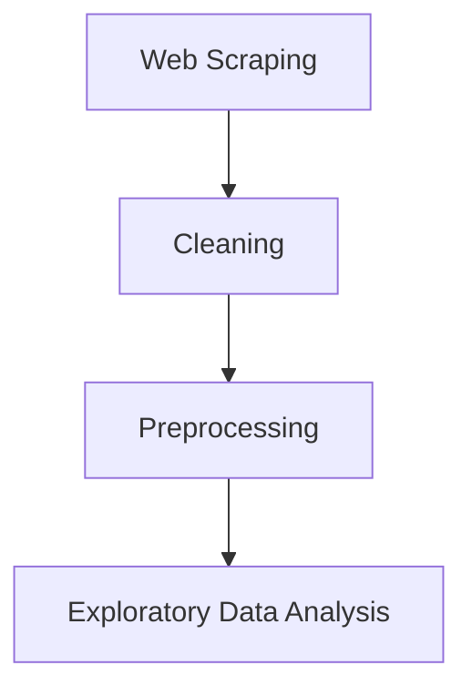

# 🏠 Estate-Miner: Egyptian Real Estate Market Data Mining & EDA


Estate-Miner is an end-to-end data mining project designed to collect, clean, preprocess, and analyze Egyptian real estate listings. The project covers the complete data lifecycle, from automated web scraping to exploratory data analysis (EDA), while preparing the dataset for future machine learning applications.

---

# 📑 Table of Contents

- Project Highlights
- Tech Stack
- Project Pipeline
- Dataset Statistics
- Business Questions
- Project Structure
- Installation
- Exploratory Data Analysis
- Key Results
- Future Work
- Contributors
- License

---

# 📌 Project Highlights

- Scraped **919+ Egyptian real estate listings**
- Automated data collection using **Playwright**
- Cleaned and validated raw property data
- Engineered **8+ analytical features**
- Performed comprehensive Exploratory Data Analysis (EDA)
- Identified the strongest factors affecting property prices
- Prepared the dataset for future Machine Learning models

---

# 🛠 Tech Stack

- Python
- Pandas
- NumPy
- Matplotlib
- Seaborn
- Playwright
- Jupyter Notebook

---

# 📈 Dataset Statistics

| Metric | Value |
|---------|------:|
| Properties | 919 |
| Features | 45 |
| Numerical Features | 34 |
| Categorical Features | 10 |
| Missing Values | 0 |
| Duplicate Records | 0 |

---

# 🎯 Business Questions

This project aims to answer several business questions, including:

- What factors have the greatest impact on property prices?
- Which regions have the highest average property prices?
- Which property types dominate the Egyptian market?
- Do amenities significantly increase property value?
- Is Price per Square Meter a better pricing indicator than total price?
- Which engineered features are most useful for predictive modeling?

---

# 🚀 Project Pipeline



---

# 📂 Project Structure

```text
Estate-Miner
│
├── Data
│   ├── Scrapped_Data.csv
│   ├── cleaned_data.csv
│   └── preprocessed_data.csv
│
├── EDA_Outputs
│
├── Web Scrapping
│   ├── config.py
│   ├── exploresite.py
│   └── localScrapper.py
│
├── Cleaning.ipynb
├── Preprocessing.ipynb
├── Real_Estate_EDA.ipynb
├── requirements.txt
└── README.md
```

---

# ⚙️ Project Pipeline

## Phase 1 — Web Scraping

### Objective

Collect Egyptian real estate listings automatically.

### Technologies

- Playwright
- Python

### Output

```
Scrapped_Data.csv
```

---

## Phase 2 — Data Cleaning

### Objective

Clean raw property listings.

### Tasks

- Remove duplicates
- Handle invalid values
- Clean prices
- Clean area measurements
- Standardize dates
- Validate rooms and bathrooms

### Output

```
cleaned_data.csv
```

---

## Phase 3 — Preprocessing & Feature Engineering

### Objective

Prepare data for analysis and machine learning.

### Engineered Features

| Feature | Description |
|----------|-------------|
| price_per_sqm | Price divided by area |
| amenities_count | Number of amenities |
| total_rooms | Bedrooms + Bathrooms |
| price_per_bedroom | Price divided by bedrooms |
| price_per_bathroom | Price divided by bathrooms |
| area_per_bedroom | Area per bedroom |
| area_per_bathroom | Area per bathroom |
| amenities_per_room | Amenities density |

### Output

```
preprocessed_data.csv
```

---

## Phase 4 — Exploratory Data Analysis

The EDA notebook contains eleven major sections:

1. Dataset Overview
2. Data Quality Assessment
3. Univariate Analysis
4. Target Variable Analysis
5. Location Analysis
6. Property Characteristics Analysis
7. Amenities Analysis
8. Relationship Analysis
9. Feature Engineering Evaluation
10. Correlation Analysis & Feature Selection
11. Executive Summary

---

# 📊 Key Results

## Price Distribution

- Property prices range from approximately **3.3M to 90M EGP**.
- Price distribution is highly right-skewed.
- Applying **log(price)** produces a more balanced distribution suitable for machine learning.

---

## Location Analysis

- North Coast contains over **50%** of all listings.
- Cairo has the highest average property prices.
- Red Sea represents a strong luxury property market.

---

## Property Characteristics

- Property area is the strongest driver of price.
- Three-bedroom properties dominate the market.
- Villas and Chalets represent the premium segment.

---

## Amenities

- Balcony and Covered Parking are the most common amenities.
- Private Pool and Private Garden are associated with luxury properties.

---

## Feature Engineering

The engineered features significantly improve analytical capability.

Most useful features include:

- Price per Square Meter
- Total Rooms
- Amenities Count
- Area per Bedroom

Features such as:

- Price per Bedroom
- Price per Bathroom

are useful for analysis but should **not** be used in machine learning because they introduce **target leakage**.

---

# 📋 Sample Dataset

| Property Type | Region | Area (sqm) | Bedrooms | Price (EGP) |
|--------------|--------|-----------:|----------:|------------:|
| Chalet | North Coast | 180 | 3 | 9,800,000 |
| Villa | Cairo | 320 | 5 | 28,500,000 |
| Apartment | Giza | 160 | 3 | 5,200,000 |

---

# 🏆 Final Results

- Successfully collected more than **900 property listings**
- Built a complete data pipeline from scraping to EDA
- Generated **8 engineered features**
- Identified the strongest pricing factors
- Produced a machine-learning-ready dataset

---

# 🔮 Future Work

Future improvements include:

- Property Price Prediction using Machine Learning
- Interactive Power BI Dashboard
- Streamlit Web Application
- Automatic Daily Data Collection
- Time-Series Market Analysis
- Property Recommendation System

---

# ⚙️ Installation

Clone the repository:

```bash
git clone https://github.com/your-username/Estate-Miner.git

cd Estate-Miner
```

Install dependencies:

```bash
pip install -r requirements.txt
```

Run Jupyter Notebook:

```bash
jupyter notebook
```

Execute notebooks in the following order:

1. Cleaning.ipynb
2. Preprocessing.ipynb
3. Real_Estate_EDA.ipynb

---

# 👥 Contributors

- Amir Ali Attia
- Omar
- Mohamed Ramadan Radwan

---

# 📄 License

This project is licensed under the MIT License.