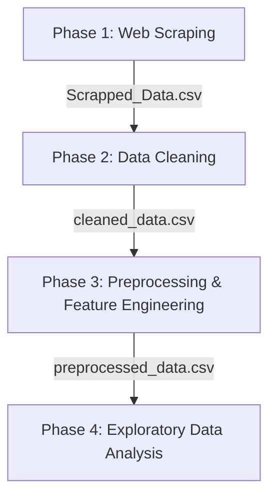

# 🏠 Estate-Miner: Egyptian Real Estate Market Data Mining & EDA

Estate-Miner is a data-driven end-to-end pipeline designed to harvest, clean, preprocess, and analyze active real estate listings in Egypt. The project covers the full lifecycle of data collection (web scraping), data cleaning, feature engineering, and exploratory data analysis (EDA) to derive actionable market insights and prepare features for machine learning modeling.

---

## 🚀 Project Pipeline & Architecture

The project is structured into four main sequential phases:



### 1. Phase 1: Web Scraping (`Web Scrapping/`)
- **Objective**: Scrape raw property listings from major Egyptian real estate portals.
- **Technology**: Built using **Playwright** for browser automation and **Python** for asynchronous data collection.
- **Scripts**: 
  - `localScrapper.py`: Crawls property portals, bypassing dynamic loading and paginations.
  - `exploresite.py`: Explores portal directories and handles structures.
- **Output**: Raw listings saved in `Data/Scrapped_Data.csv`.

### 2. Phase 2: Data Cleaning (`Cleaning.ipynb`)
- **Objective**: Parse raw text, clean data points, and handle anomalies.
- **Tasks**:
  - Eliminates duplicates and empty listings.
  - Formats data columns (area, price, room count, and dates).
  - Handles logical consistency checks (e.g. validating rooms vs bathrooms, positive pricing).
- **Output**: Pristine dataset saved in `Data/cleaned_data.csv`.

### 3. Phase 3: Preprocessing & Feature Engineering (`Preprocessing.ipynb`)
- **Objective**: Perform data enrichment and feature engineering for analysis and future modeling.
- **Engineered Features**:
  - `price_per_sqm`: Price per square meter (market value-density).
  - `amenities_count`: Total number of amenities listed.
  - `total_rooms`: Aggregate sum of bedrooms and bathrooms.
  - `price_per_bedroom` / `price_per_bathroom`: Value indicators.
  - `area_per_bedroom` / `area_per_bathroom`: Spaciousness indices.
  - `amenities_per_room`: Density of premium additions.
- **Output**: Preprocessed dataset saved in `Data/preprocessed_data.csv`.

### 4. Phase 4: Exploratory Data Analysis (`Real_Estate_EDA.ipynb`)
- **Objective**: Extract business intelligence and analyze listing behaviors.
- **Sections**:
  1. **Dataset Overview**: Size, dimensions, and type distributions.
  2. **Data Quality Assessment**: Checks for missing values, outliers, and skewness.
  3. **Univariate Analysis**: Explores numerical and categorical dimensions.
  4. **Price Analysis**: Target skewness evaluation and log-transform testing.
  5. **Location Analysis**: Regional pricing rankings (North Coast, Cairo, Red Sea, Giza, Suez).
  6. **Property Characteristics**: Price vs size relationships.
  7. **Amenities Analysis**: Statistical test of amenity frequency and price premium impact.
  8. **Relationship Analysis**: Heatmaps, regression plots, and crosstab stacked bar charts.
  9. **Feature Engineering Evaluation**: Target leakage and ML suitability assessment.
  10. **Correlation Analysis & Feature Selection**: Multicollinearity evaluation.
  11. **Executive Summary**: Comprehensive business findings and recommendations.

---

## 📂 Project Structure

```bash
├── Data/
│   ├── Scrapped_Data.csv       # Raw listing records from scrapers
│   ├── cleaned_data.csv        # Cleaned listings
│   └── preprocessed_data.csv   # Enriched listings with engineered features
│
├── EDA_Outputs/                # Visualizations saved from EDA runs
│
├── Web Scrapping/              # Playwright scraper scripts & configurations
│   ├── config.py
│   ├── exploresite.py
│   └── localScrapper.py
│
├── Cleaning.ipynb              # Jupyter Notebook for Stage 2
├── Preprocessing.ipynb          # Jupyter Notebook for Stage 3
├── Real_Estate_EDA.ipynb        # Master Jupyter Notebook for Stage 4 (EDA)
├── requirements.txt            # Python dependencies
└── LICENSE                     # Open source license
```

---

## ⚙️ Installation & Usage

### 1. Install Dependencies
Ensure you have Python 3.8+ installed, then run:
```bash
pip install -r requirements.txt
```

### 2. Configure Scrapers
If crawling new data, copy the `.env.example` to `.env` in the `Web Scrapping` folder and configure variables:
```bash
cd "Web Scrapping"
cp .env.example .env
playwright install
python localScrapper.py
```

### 3. Run Notebooks
Open the Jupyter environment to execute the pipeline notebooks:
```bash
jupyter notebook
```
Run `Cleaning.ipynb`, `Preprocessing.ipynb`, and then `Real_Estate_EDA.ipynb` sequentially.

---

## 👥 Contributors & Team Members

We would like to acknowledge the hard work and contributions of the following team members who made this project possible:

<!-- 
👉 EDIT THIS SECTION: Replace the placeholders below with the names, roles, and details of the contributors who worked on the project.
-->

* **[@AmirAliAttiaAli]**
* **[@OmarCoder9]** 
* **[@Mohamed-Ramadan-Radwan]**


---

## 📄 License
This project is licensed under the MIT License - see the [LICENSE](LICENSE) file for details.